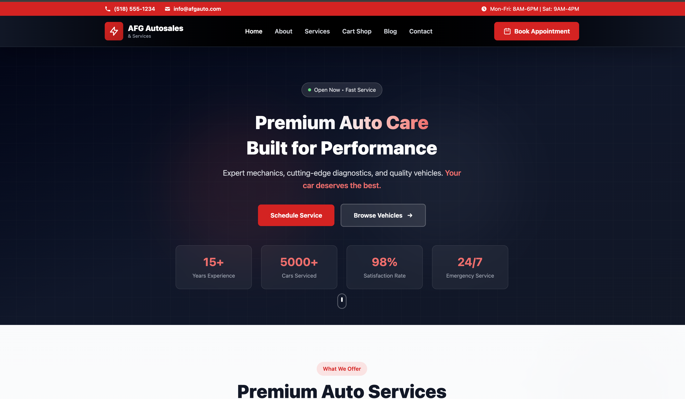

#  Garage & Car Shop Website


[](https://github.com/lamarana20/Garage-website-and--carshop.git)
[](https://astro.build/)
[](LICENSE)

Welcome to the **Garage & Car Shop** project, a modern website built with **Astro** and **Tailwind CSS**. Users can browse available vehicles, book services, and contact the garage.

---

## 🔗 Project Link

Check out the Live: [Garage & Car Shop](https://cool-mandazi-c87d8a.netlify.app/)

---

##  Project Structure

```text
/
├── public/                
│   ├── favicon.svg
│   └── images/           # Garage and vehicle images
├── src/
│   ├── assets/           
│   │   └── astro.svg
│   ├── components/       
│   │   ├── Welcome.astro
│   │   ├── About.astro
│   │   ├── Hero.astro
│   │   ├── Header.astro
│   │   ├── Footer.astro
│   │   ├── Service.astro
│   │   └── Contact.astro
│   ├── layouts/          
│   │   └── Layout.astro
│   └── pages/            
│       ├── index.astro
│       └── Inventory.astro  <-- Main vehicle listing
├── vehicles.json         # Vehicle data source
└── package.json
